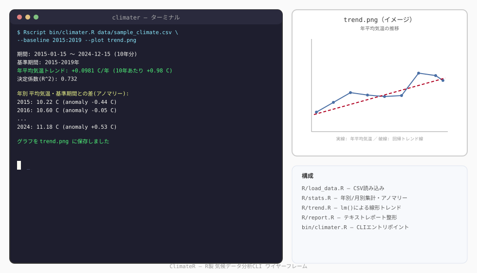
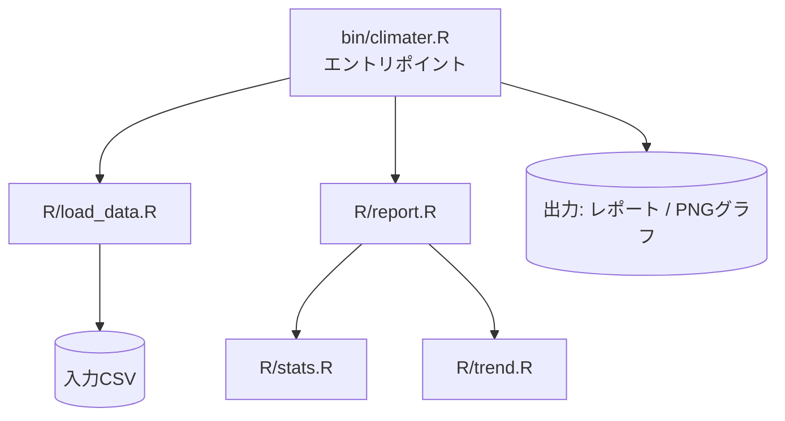
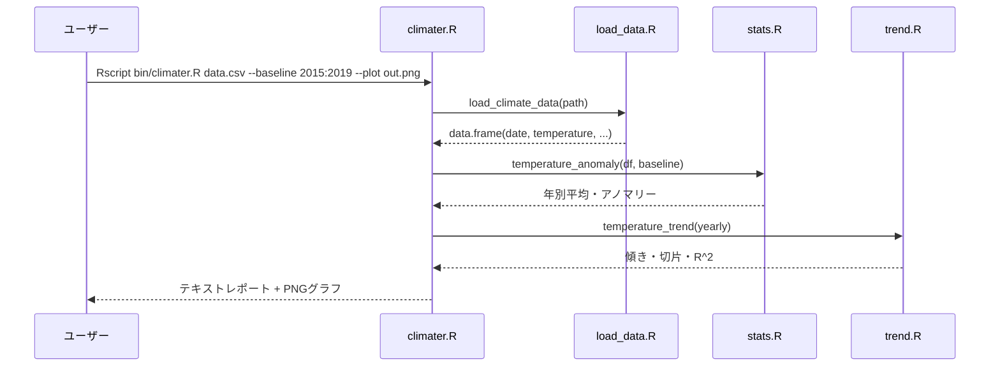

# ClimateR 🌡️

コマンドラインで動く、気候データ分析ツール。「15の言語で15個のアプリを作る」ポートフォリオプロジェクトの11本目（R編）。


## 目次

* [概要](#概要)
* [特徴（主な機能）](#特徴主な機能)
* [想定ユーザー（ペルソナ）](#想定ユーザーペルソナ)
* [UIイメージ](#uiイメージ)
* [技術スタック](#技術スタック)
* [システム構成図](#システム構成図)
* [データ構造](#データ構造)
* [セットアップ](#セットアップ)
* [コマンド一覧](#コマンド一覧)
* [今後の展望](#今後の展望)

## 概要

ClimateRは、気温のCSVデータを読み込み、年別・月別の平均気温、基準期間からの偏差（アノマリー）、そして線形回帰による昇温トレンドを計算するコマンドラインツールです。

`tidyverse`や`ggplot2`のような外部パッケージは使わず、base R（標準搭載の`stats`・`graphics`パッケージ）だけで完結させています。回帰分析には base R の`lm()`（最小二乗法）を使い、グラフ出力も base R の`plot()`/`png()`のみで行っています。テストも`testthat`は使わず、これまでの言語と同じ自作アサーションハーネスで書いています。

## 特徴（主な機能）

- CSVからの気候データ読み込み（日付・気温・降水量）
- 年別・月別の平均気温の集計
- 基準期間（例: 2015〜2019年）を基準にした気温アノマリー（偏差）の計算
- 線形回帰による昇温/寒冷化トレンドの推定（℃/年、決定係数R²付き）
- 任意の年の気温を線形外挿で予測
- テキストレポート出力、および任意でPNGグラフの出力

## 想定ユーザー（ペルソナ）

気象データや自分で記録した気温ログを手元で分析したい学習者・研究者の卵を想定しています。Excelでの手作業や重いBIツールを使わず、CSVを渡すだけでその場でトレンドと数値サマリーを得たい人に向いています。衛星データの取得や大規模気候モデルの再現など、本格的な気候科学の領域は対象外です。

## UIイメージ



典型的な使用フロー（CSV指定→レポート出力→グラフ保存）のターミナル出力イメージです。

## 技術スタック

| 分類 | 技術 |
| --- | --- |
| 言語 | R 4.0+ |
| 統計処理 | base R の`stats`パッケージ（`lm()`による単回帰） |
| グラフ描画 | base R の`graphics`パッケージ（`plot()`/`png()`） |
| テスト | 自作アサーションハーネス（`tests/test_harness.R`） |
| CI/CD | GitHub Actions（`r-lib/actions/setup-r`） |
| 依存管理 | なし（外部Rパッケージ・renv不使用） |

## システム構成図





## データ構造

入力CSVは以下の列を想定しています。

| 列名 | 型 | 説明 |
| --- | --- | --- |
| `date` | 日付（YYYY-MM-DD） | 観測日 |
| `temperature` | 数値 | 気温（摂氏）。日別・月別どちらの粒度でも可 |
| `precipitation` | 数値（任意） | 降水量（mm）。現バージョンでは読み込むだけで未使用 |

サンプルデータ`data/sample_climate.csv`は、架空の都市を想定した2015〜2024年の月別気温・降水量データです（実在の観測地点のデータではなく、緩やかな昇温トレンドを模した合成データです）。

分析結果は内部的に以下の`data.frame`として扱われます。

| 列名 | 説明 |
| --- | --- |
| `year` | 年 |
| `mean_temperature` | その年の平均気温 |
| `anomaly` | 基準期間平均との差 |

## セットアップ

R 4.0以上が必要です。追加パッケージのインストールは不要です（base Rのみ）。

```bash
# Rのバージョン確認
Rscript --version

# サンプルデータでレポートを出力(サンプルは2015-2024年なので基準期間もその範囲に合わせる)
Rscript bin/climater.R data/sample_climate.csv --baseline 2015:2019

# グラフも保存する場合
Rscript bin/climater.R data/sample_climate.csv --baseline 2015:2019 --plot trend.png
```

実行例（サンプルデータ、基準期間2015-2019年）:

```
期間: 2015-01-15 〜 2024-12-15 (10年分)
基準期間: 2015-2019年
年平均気温トレンド: +0.0981 C/年 (10年あたり +0.98 C)
決定係数(R^2): 0.732

年別 平均気温・基準期間との差(アノマリー):
  2015: 10.22 C (anomaly -0.44 C)
  2016: 10.60 C (anomaly -0.05 C)
  2017: 10.88 C (anomaly +0.22 C)
  ...
  2024: 11.18 C (anomaly +0.53 C)
```

### テストの実行

```bash
Rscript tests/run_tests.R
```

全テストが成功すると`全テスト成功`と表示され、終了コード0で終わります（CIはこれを合否判定に使っています）。テストは一時ファイル（`tempfile()`）や関数内で組み立てたその場限りのデータを使うため、`data/sample_climate.csv`には影響しません。

## コマンド一覧

`bin/climater.R`は単一のサブコマンドで動くシンプルなCLIです。

| 引数 | 説明 |
| --- | --- |
| `<csvファイル>`（必須） | 分析対象のCSVファイルパス |
| `--baseline START:END` | アノマリー計算の基準期間（省略時は`1991:2020`） |
| `--plot 出力先.png` | 指定するとPNGグラフ（年平均気温の推移＋トレンド線）を保存 |

## 今後の展望

- 降水量（`precipitation`列）を使った分析（月別降水量トレンド、乾湿の偏りなど）
- 季節別（四半期別）のトレンド分析
- 複数地点のCSVを比較するモード
- CSV以外の入力形式（NetCDF等）への対応
- 移動平均によるスムージング表示

あくまで手元のCSVを対象にした学習・ポートフォリオ用途のツールという位置づけで、公式気象データセットの自動取得や大規模データ処理は対象外です。
